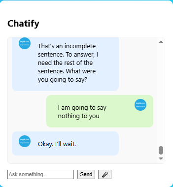

# 💬 Chatify – AI-Powered Q&A Web App

Chatify is a sleek, responsive, and fully-functional AI Question-Answering web app that allows users to input queries and receive answers generated using the Google Gemini API (Gemini 1.5 Flash or Pro). It’s designed with a modern UI and optimized for performance and accessibility.

---

## 🚀 Live Demo

🌐 [View on Vercel](https://chatify-ruby.vercel.app/) 

---

## 📸 Screenshots

| Home Page                        |
|----------------------------------|
| |

---

## 🧠 Features

- 🔮 Powered by **Google Gemini AI** (1.5 Flash or Pro)
- 🎨 Beautiful UI using **CSS**
- 🧩 **Responsive** layout for all devices
- 💬 Easy prompt input + scrollable answer section
- 🧪 Extensible backend via `Express.js`

---

## 🛠️ Tech StackS
| HTML          | Node.js (Express) | Google Gemini 1.5 Flash / Pro |
| CSS  AND JS   | dotenv            | @google/generative-ai          |
  
---

## 📂 Project Structure

```bash
chatify/
├──screenshots
|       ├── image.png
├──node_modules
├── public/
│       ├── index.html
│       ├── style.css
│       └── script.js
├── server.js
